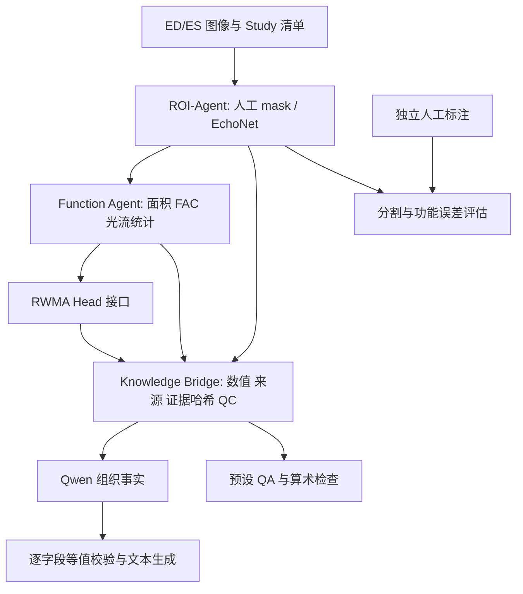

# Cardiac-Agent 技术文档

更新日期：2026-09-18。项目为独立心超研究系统，GitHub 目标为 `IreliaNeu/Cardiac-Agent`。
代码不依赖 RS-Agent 或 Lagent；复用了模块化、证据传递和评估记录的设计经验。

## 1. 整体目标和当前定位

依据 Overview-Pipeline 的 M→F→Y→E 设计：从 ED/ES 心超双帧提取左室腔 mask（M），
计算功能特征（F），通过未来训练的预测头获得 RWMA（Y），再用结构化证据约束解释（E）。
目前完成真实图像的人工/模型双路径、功能计算、证据归档、Qwen 事实报告及对照评估。
RWMA 监督学习、开放临床解释和医学 Web Demo 尚未完成。

当前 Agent 是职责明确、按固定顺序执行的流水线模块；没有引入自主规划、长期记忆或
多 Agent 自由对话。固定执行图有利于核对实验条件和定位数值错误。未来可在其外层加入
工具路由与用户问答，保持测量和预测流程可复现。



## 2. 目录和模块职责

| 位置 | 职责 | 输入和输出 |
| --- | --- | --- |
| schemas.py | Pydantic 数据契约 | Study、Measurements、Prediction、KnowledgePacket、Explanation |
| camus.py | 医学图像导入 | CAMUS MHD/NIfTI → PNG、多类 mask、spacing、source.json |
| roi.py | 感知与 ROI | 原始双帧 → 两张 LV cavity 布尔 mask |
| function.py | 功能计算 | 双帧和 mask → 面积、FAC、ratio、D 的均值/方差 |
| rwma.py | 预测协议 | 特征 → predicted / unavailable / abstained |
| pipeline.py | 执行与证据归档 | 六个阶段顺序执行、独立 UUID、原子 JSON、哈希 |
| explanation.py | API 与解释 | 五项证据 → Qwen 排序 → 校验后的事实文本 |
| evaluation.py | 单例评价 | Dice、IoU、面积误差、预设 QA、可选独立标签准确率 |
| benchmark.py | 对照批评估 | 多病例 → 人工/预测两条路径、误差汇总及失败数 |
| scripts/camus_pilot.py | 数据与人工流程试跑 | 下载三个官方病例、导入、逐像素核对和复算 |
| scripts/evaluate_segmentation.py | GPU 对照入口 | 多个 Study 和模型配置 → cases.json / summary.json |

## 3. 输入和模型预处理

同一检查、同一切面的 ED/ES 必须共享图像网格与像素标定。当前由数据集提供相位，
没有自动检测 ED/ES。Study 使用清单相对路径；运行时解析为绝对路径。
人工路径需同时提供 ed_mask/es_mask、mask_source=manual 和正确 foreground_label。
模型路径省略两张 mask，mask_source=predicted。

CAMUS 导入检查 size、spacing、origin、direction 一致，保留 0/1/2/3 多类标注，
其中 label=1 用于 LV cavity。非 uint8 双帧采用共同 min/max 映射到 0-255；原始 NIfTI
和转换出处、解码数组哈希均保留。该映射不使用标注。当前 pilot 的浮点图像取值为 0-255。

EchoNet 为官方 DeepLabV3-ResNet50 单通道输出。输入双线性缩放到 112x112，
按官方 EchoNet-Strain 默认 RGB mean/std 标准化。输出 logits 恢复原图大小，阈值为 0。
权重以 weights_only=True 读取并严格加载。mean/std、下载链接、device 在
`configs/echonet.official.json`；每次模型运行记录权重和配置 SHA256。
当前批量评估入口限定 A4C；A2C 没有模型效果验证。

## 4. Function 与 RWMA

采用如下量：A_ED、A_ES 为 LV 像素数；若有 spacing，则面积乘以 sx×sy 得 mm²。

- FAC = 100 × (A_ED − A_ES) / A_ED。
- area_ratio = A_ES / A_ED。
- D 的 mean/var 在 ED cavity mask 内计算；保存的图外区域置零。
- intensity_difference 为归一化灰度强度差，是早期工程基线。
- farneback 为 OpenCV 稠密光流幅值，单位 pixels_per_ED_ES_pair。
- none 跳过差异图计算。

Overview 建议 optical flow 或 feature difference；原始强度差不能称为学习特征差异。
Farneback 实现已接入。由于只有两个相位、腔内散斑不一定代表心肌对应点，它只能作为
稀疏时相运动基线，不能直接解释为应变。FAC 与 area_ratio 共线，训练时应去除冗余。

RWMA 目前使用 UnavailableRWMA。无模型时不产生概率；出现阻断 QC 时 abstained。
后续应使用独立病例级或节段级 RWMA 标注训练 MLP/分类器，进行患者级划分、校准和消融。
不能由 FAC、EF 或 CAMUS 分割标注生成伪 RWMA 真值。

## 5. Knowledge Bridge、解释和 QA

KnowledgePacket 保存 mask 来源、相位来源、指标、RWMA 状态、输入/产物引用与哈希、QC、
方法限制。服务器数据集的医学指标已获得用户授权，可调用千问 API，无需逐次确认。

当前请求只传五项：area_ed_px、area_es_px、fac_percent、area_ratio、rwma_status。
Qwen 返回证据 ID→数值字符串映射或 claims 列表。系统检查字段集合、条目数及数值完全一致，
再按模板生成报告。接口失败、非法 JSON 或数值改动触发 template_fallback，并记录原因。
HTTP 429/部分 5xx 和网络异常最多三次尝试；日志不保存密钥或服务端原始错误正文。
每次请求独立保存尝试次数、HTTP 状态、延迟、tokens，避免批量复用旧遥测。

当前解释没有使用光流统计，尚未达到 Overview 的完整临床语义解释。该缺口需通过临床定义、
校验规则及医生评价补齐，而不是简单让 LLM 根据 FAC 下结论。

QA 目前回答面积是否减小、RWMA 是否可判断、FAC 是否等于 LVEF，并检查算术一致性。
Overview 的“收缩功能是否正常”与 RWMA 是不同任务；后续需要分别定义真值和评价。
当前不使用未经验证的 FAC 阈值赋予正常/异常标签。缺失预测不计入准确率分母。

## 6. 运行方案

### CPU 人工标注路径

```bash
conda env create -f environment.yml
conda activate cardiac-agent
pip install -e '.[medical_io]'
python scripts/camus_pilot.py --output data/camus-pilot
cardiac-agent run data/camus-pilot/converted/patient0001-4CH/study.json --output runs
```

### GPU 模型路径

```bash
conda env create -f environment.gpu.yml
conda activate cardiac-agent-gpu
mkdir -p models
curl -fL --retry 2 https://github.com/echonet/dynamic/releases/download/v1.0.0/deeplabv3_resnet50_random.pt \
  -o models/deeplabv3_resnet50_random.pt
python scripts/evaluate_segmentation.py \
  --studies data/camus-pilot/converted/patient0001-4CH/study.json \
            data/camus-pilot/converted/patient0002-4CH/study.json \
            data/camus-pilot/converted/patient0003-4CH/study.json \
  --config configs/echonet.official.json \
  --output runs/echonet-flow --deformation farneback --qwen --env .env
```

私有 .env 字段见 `.env.example`。服务器继续通过 `--env /root/autodl-tmp/RS-Agent/.env`
读取现有 key；没有将凭据复制进新仓库。上例的 .env 是独立部署时的路径。
新输出目录不能已存在。只验证人工模式时无需下载权重或配置 GPU。

服务器已有 `cardiac-agent`（Python 3.11）和 `cardiac-agent-gpu`（Python 3.12）。
GPU 环境通过克隆已有环境快速建立，再单独安装医学依赖；提供的 environment.gpu.yml
用于新机器重建最小依赖，尚未在一台空机器上完整重建验证。

## 7. 当前结果与解释

人工路径：3 病例、2CH/4CH 共 6 对，12 张 mask 与原始 NIfTI 逐像素一致，面积及 FAC
独立复算通过。该结果验证转换和算术，不是模型分割性能。

模型路径：官方 EchoNet 直接推理 3 个 CAMUS A4C 病例，没有在 CAMUS 上微调或调参。

| 病例 | ED Dice | ES Dice | 人工 FAC (%) | 模型 FAC (%) | FAC 绝对误差（百分点） |
| --- | ---: | ---: | ---: | ---: | ---: |
| 1 | 0.8693 | 0.8600 | 45.3075 | 40.1523 | 5.1553 |
| 2 | 0.8563 | 0.7374 | 31.4475 | 46.6687 | 15.2212 |
| 3 | 0.8885 | 0.8941 | 40.0050 | 35.9491 | 4.0559 |

六帧平均 Dice=0.850927，IoU=0.743959，平均绝对面积误差=6032.83 pixels。
三病例 FAC MAE=8.1441 个百分点，失败率=0/3。
第 2 病例 ES 腔室低估明显，表明分割误差会传递到功能量；后续需优先改善这类失败。
三个病例按名称顺序选取，不能据此估计总体临床性能，也没有评估 RWMA 分类准确率。

Qwen：真实人工 mask 指标一次请求成功（2.46 秒，224 tokens）；模型路径三次成功，
数值均通过等值检查。该结果表明接口与事实传递正常，不能替代解释质量的医生评价。
光流追加实验、最终测试数和备份信息见本阶段进度文档。

## 8. 评估、审计和复现

benchmark 每个病例分别运行人工和模型路径。模型输入清单去除人工 mask，参考标注仅用于
评价。输出每相位 Dice/IoU、有符号面积误差和每病例 FAC 绝对误差。失败病例仍保留在
requested 分母，成功均值注明适用范围；全失败时均值为 null，不能伪报为 0。

```bash
pytest -q
ruff check src tests scripts
cardiac-agent verify runs/RUN_ID
```

每次运行保存 request、mask、deformation、measurements、rwma、knowledge、explanation、
evaluation、run 和 checksums。异常保存 failure.json。原子 JSON 写入先 fsync 再替换。
源码哈希和模型配置指纹用于追溯。verify 校验运行产物和原始输入，不能证明临床正确性。
证据使用服务器绝对路径，迁移后需路径映射或重跑；直接修改历史证据会破坏哈希。

## 9. 与 Overview 的完成度及后续计划

| 设计环节 | 当前情况 | 后续重点 |
| --- | --- | --- |
| ROI | 人工/预训练网络路径完成小样本验证 | 扩大验证、形态质控、域适应、A2C 单独验证 |
| Function | FAC/ratio/差异图/光流接口 | 时序和轮廓运动、对应关系质控、鲁棒特征 |
| RWMA | 契约及未就绪状态完成 | 独立标注、分类器训练、患者级评估与校准 |
| Explanation | API 事实排序与严格核验 | 加入 D/Y 证据、临床语言与医生盲评 |
| QA | 三项确定性问答 | 临床问题集、用户问答、区分功能异常与 RWMA |
| Knowledge Bridge | 数据结构、引用与哈希完成 | 版本迁移、可移植审计与重放 |
| Demo | 待实现 | 导入、双帧显示、mask 对照、数值与证据问答 |

建议下一阶段先扩大 A4C 分割样本和误差传播评估，同时与医工合作方确定 RWMA 标签。
在标签到位前，可以开发证据浏览 Demo；不能把尚未训练的 RWMA 作为演示中的已实现能力。
长期记忆如引入，优先保存研究配置、运行索引及用户偏好，避免把旧病例结论当作新病例证据。

## 10. 发布范围与来源

公开仓库包含代码、测试、配置模板、英文 README 和中文技术/进度文档。
原始图像、人工标注、逐病例运行目录、模型权重和 .env 排除在 Git 之外，保留在双端备份。
Overview 合作设计文档不随代码上传。上游模型和数据保留各自使用条款与引用要求。

- EchoNet-Dynamic：https://github.com/echonet/dynamic
- EchoNet-Strain 参数：https://github.com/echonet/strain/blob/main/Segmentation%20Analysis/Vid_to_Strain.py
- CAMUS：https://www.creatis.insa-lyon.fr/Challenge/camus/databases.html
- RS-Agent 工程背景：https://github.com/IreliaNeu/RS-Agent
